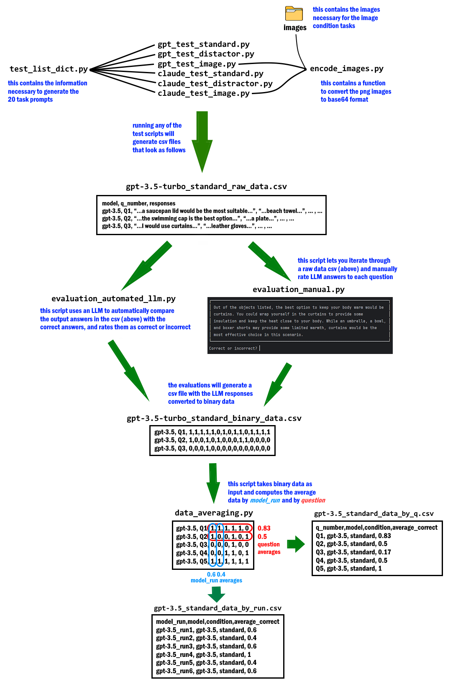

# LLM Tool Innovation Evaluation Project

## Project Overview
This project enables the evaluation of OpenAI's GPT models and Anthropic's Claude models on an original set of 20 tool innovation tasks. The task structure is based on the tasks in Yiu, Kosoy, and Gopnik's [2023](https://journals.sagepub.com/doi/10.1177/17456916231201401) study. The tasks are novel and designed by me for a paper in collaboration with [Vanessa Cheung](https://scholar.google.com/citations?user=_9RYSjEAAAAJ&hl=en) and [David Lagnado](https://scholar.google.com.sg/citations?user=AMb1WywAAAAJ&hl=en). I will provide a link to our preprint when it's ready. 

This project enables researchers to replicate our results and to modify the tasks as they see fit.

Here's an example of what a task looks like in the standard condition:

>Your task is to take a baked and hot cake out of the oven. Normally, you would use oven mittens to accomplish this task. However, oven mittens are not available to you. At your disposal, you have the objects listed below. Which of these would you use to accomplish the task?
>
>A balloon --- A saucepan lid --- A beach towel --- A chef's hat

The distractor condition has 9 options instead of 4, and the image condition replaces the 4 option objects with images.


## Project Workflow
The workflow consists of data generation, evaluation, and averaging scripts. There are three gpt test scripts and three claude tests scripts, each corresponding to a different experimental condition.

In each of these scripts, one can easily configure the number of responses per question, the OpenAI/Anthropic models to be prompted, the model temperature, and whether to use CoT prompting (only possible in standard and image conditions). For example:

```python
model_options = ["claude-3-sonnet-20240229", "claude-3-5-sonnet-20240620"]
model = model_options[1]
temperature = 0
model_runs = 10 # number of answers to be collected per question
cot = False     # activate or deactivate the Chain-of-Thought prompt
```

The `test_list_dict.py` contains the specifications to generate the 20 prompts. If you want to change or add tasks, you can easily do so by changing this list.

**Step 1**: Configure and run a model test script. The models will be prompted with the test prompts and the model text output will be stored in a csv file. 

**Step 2**: Configure and run evaluation_manual or evaluation_automated_llm. Set the configuration so that it matches the model whose data you want to evaluate. 

The evaluation scripts will iterate through each of the model's answers and convert them to binary form. The manual evaluation requires you to check and rate the answer yourself, while the automated LLM evaluation involves an LLM checking the output answer against the correct answer. The output of the evaluation process is a csv file containing the model responses in binary (1 = correct, 0 = incorrect). 

NB: My experience has been that automated LLM answer evaluations are not 100% accurate, and so I have done all the answer evaluations manually. Using the LLM to evaluate answers should only be done if one repeatedly compares LLM and human evaluations and find them to be identical. 

**Step 3**: Configure and run the data_averaging script. Set the configuration so that it matches the model whose data you want to process. 

The averaging script, taking the binary data as input, will compute two types of averages. First, it will compute model_run averages. One "model_run" is a single round of model answers to the 20 questions. For example, if you configure a test script to generate 10 answers per question, there are 10 model_runs (see workflow diagram). Second, the script will compute question averages, the accuracy of the model per individual question. 


**Workflow Diagram**
<br>
<details>
<summary>Click here to see Workflow Diagram</summary>

</details>


## Scripts Overview
- **Data Generation Scripts**:
  - `gpt_test_standard.py`: Collects data from GPT models in the standard condition.
  - `gpt_test_distractor.py`: Collects data from GPT models in the distractor condition.
  - `gpt_test_image.py`: Collects data from GPT models in the image condition.
  - `claude_test_standard.py`: Collects data from Claude models in the standard condition.
  - `claude_test_distractor.py`: Collects data from Claude models in the distractor condition.
  - `claude_test_image.py`: Collects data from Claude models in the image condition.
  - *Supporting scripts*
    - `test_list_dict.py`: Contains task specifications shared across data generation scripts.
    - `encode_images.py`: Function for encoding images from the "images" folder in base64 format, used in the image condition scripts.

- **Data Processing Scripts**:
  - `evaluation_manual.py`: Iterates through LLM output and lets you manually check and rate answers, produces binary data (correct/incorrect).
  - `evaluation_automated_llm.py`: Uses an LLM to check and rate the answers, produces binary data.
  - `data_averaging.py`: Based on binary data, computes model_run and question accuracy averages.
  - `display_text.py`: Function to present text in a more readable format, used in evaluation_manual script. It's useful if you're using PyCharm.

- **Images Folder**:
  - Contains 20 subfolders, one for each task. Each subfolder contains four images. These are used in the image condition test scripts.


## Prerequisites
* Python >= 3.12
* OpenAI API key (for GPT model testing)
* Anthropic API key (for Claude model testing)

The project dependencies are listed in `requirements.txt` and can be installed via pip:
```bash
pip install -r requirements.txt
